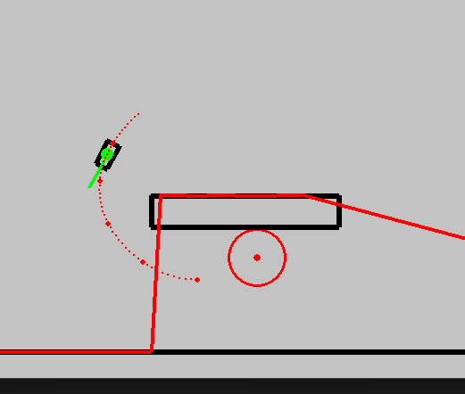
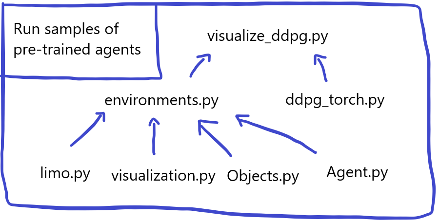

# Master thesis project 2023

Henrik Fjellheim, NTNU - IDI - NorwAI




## Getting started
Activate venv, install requirements, then run:
```
python -m venv venv

-- Windows
.\venv\Scripts\activate

-- MAC / Linux
source venv/bin/activate

pip install -r requirements.txt

```


- (The project was made with **python 3.8 64 bit** version in 2023, but most packages can safely be upgraded to newer versions)
    - (Example is the gym package, which has been replaced fully with gymnasium.)

```
python -m DDPG.visualize_ddpg
```

IF you dont have CUDA enabled / don't have a NVIDIA graphics card, you need to go into /DDPG/ddpg_torch.py, and set:

```
disable_cuda=True
```
- If you still struggle with the cuda version (might be deprecated), run a fitting installation from: https://pytorch.org/get-started/locally/


## Details and description

📦 MASTER_THESIS_2023  
┣ 📂 DDPG  
┃ ┣ 📜 ddpg_torch.py  
┃ ┣ 📜 environments.py  
┃ ┣ 📜 locations.py  
┃ ┣ 📜 main_torch.py  
┃ ┗ 📜 visualize_ddpg.py  
┣ 📜 limo.py  
┣ 📜 Object.py  
┣ 📜 Agent.py  
┣ 📜 visualization.py  
┗ 📜 Vehicle.py  


These are the important files for this project.
- **Object.py** defines all objects in the simulated env, including the bodies of the agents.
- **visualization.py** contains the class for visualising all objects, using pygames - including simulated lidar rays.
- **Agent.py** contains all agent-related code, as well as some methods for self-driving reactive agents. 
- **Vehicle.py**: defines the vehicle dynamics on top of the Object; allowing it to move according to its inner model. The circograms are defined here (simulated LIDAR).
- **limo.py**: is just a testing framework, for manually running agents on vehicles - not much content here otherwise.

**DDPG:** Here are the AI agents - based on DDPG as well as DDPG + MPC (the PDRL)
- **ddpg_torch.py**: RL training logic, DDPG code as well as the Agent and the MPC_Agent code - being the DDPG based and PDRL based agents. Can train or load weights into an agent.
- **environments.py**: Defines some pre-made environments to train and test agents in. They are defined as gym environments, and can (potentially) be used by any gym-compatible agent.
- **locations.py**: Are the actual object-combinations being used into the environments.
- **main_torch.py**: All the training-code. Combines an agent with an environment, and runs a training run.
- **visualize_ddpg.py**: For running visualizations of pre-trained agents, inside environments.

### For running visualizations of pre-trained agents:

```
python -m DDPG.visualize_ddpg
```

Uncomment the test you want to run, or make your own.


